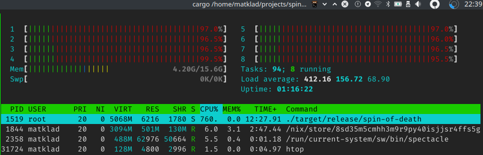

# spin of death

This repository demonstrates the danger of using spin locks, using `getrandom` as an example.
Specifically, this example demonstrates priority inversion:

* A low-priority enters a critical section, protected by a spin-lock.
* A number of high-priority threads displace the low priority threads.
* High priority threads try to enter the same critical section.
* A low priority never gets a chance to finish its critical section.


In `getrandom`'s case the critical section is global one time initialization of `/dev/urandom`.

The example uses Linux real time priority threads, so it should be run with `sudo`.

Here are the results with current `getrandom`:

```
22:37:24|~/projects/spin-of-death|HEAD⚡?
λ cargo build --release && time sudo ./target/release/spin-of-death
    Finished release [optimized] target(s) in 0.01s
^CCommand terminated by signal 2
real 136.54s
user 96.02s
sys  940.70s
rss  6880k
```




Here are the results with [patched](https://github.com/matklad/getrandom/commit/a7dc21fed9b789832702b98807a62de7bf7312d4) `getrandom`, which uses `std::sync::Once` for synchronization, instead of a spin lock. Internally, `Once` does a syscall to get blocking, so OS is able to notice that priority inversion is happening and increase the priority of lock-holding thread accordingly.


```
22:32:30|~/projects/spin-of-death|HEAD⚡?
λ cargo build --release --features os-blocking-getrandom && time sudo ./target/release/spin-of-death
    Finished release [optimized] target(s) in 0.01s
real 0.51s
user 0.01s
sys  0.04s
rss  6912k
```
